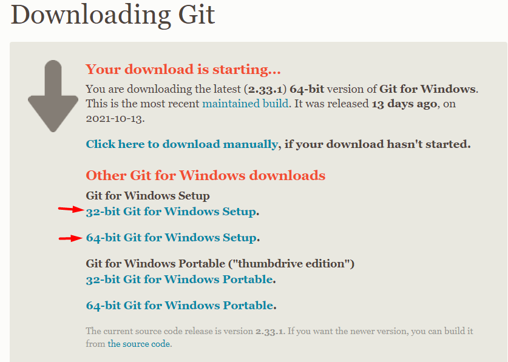
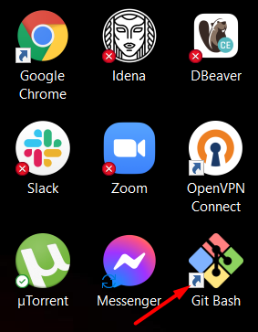

# УСТАНОВКА GIT  НА WINDOWS
------

1. Перейдите по [ссылке](https://git-scm.com/download/win)

2. Выберите установку для Windows

Скачается установочный файл с расширением .exe 

3. Запустите установочный файл.

4. Проследуйте по процедуре установки нажатием кнопки "next". Все настройки уже будут по умолчанию, но можно добавить настройку иконки на рабочий стол.

5. В конце нажать на кнопку "install"

6. После установки нажмите кнопку "finish"

7. Убедитесь, что на рабочем столе появила иконка командной строки GitBash

