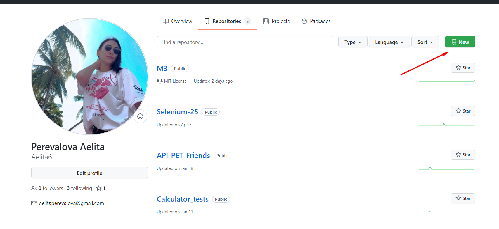
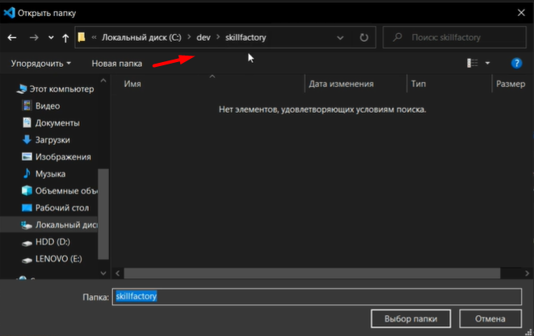
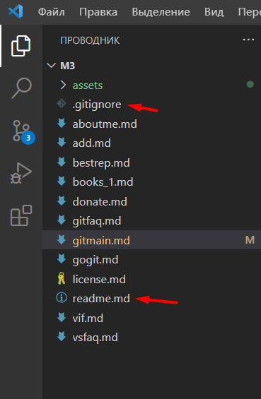
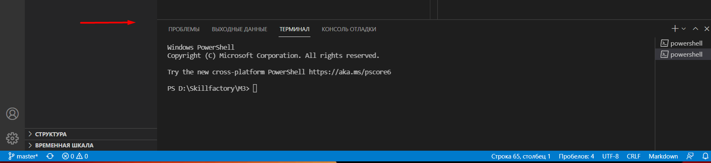
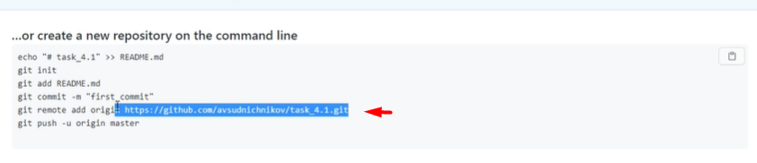
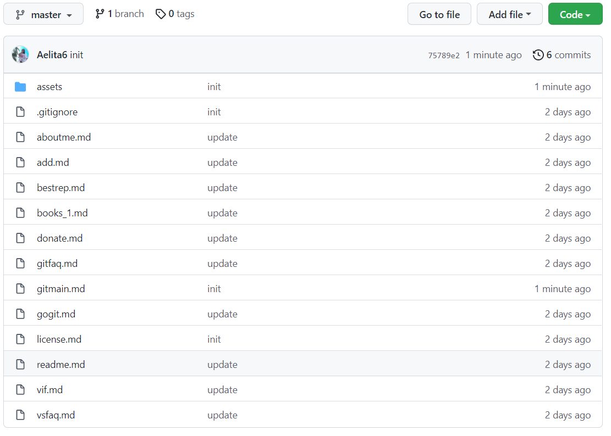

# ЧТО ТАКОЕ GIT И ДЛЯ ЧЕГО ОН НУЖЕН?

---

***Git*** — распределённая система управления версиями, которая была создана Линусом Торвальдсом, изначально для управления разработкой ядра Linux

***Github*** - это хостинг репозиториев, с которым работают чуть-ли не все современные разработчики.

---

## Для начала необходимо [установить GIT](./gitfaq.md) 

 ( *в данном случае, установка для Windows* )

---

## Для удобства работы с кодом и создания проектов, так же [установим Visual Studio](./vsfaq.md)

( *популярный и легкий в работе редактор кода* )

 
  

# Регистрация на Github и создание репозитория

* Зайти на сайт https://github.com/
* Зарегестрироваться по e-mail
* Заполнить данные профиля
* Нажать кнопку "new"

* Написать название репозитория, сделать его публичным или приватным, нажать кнопку "create"

 
 
 
 # Создание проекта в Visual Studio Code

* Запустить Visual Studio Code
* На начальном экране нажмите "Файл">"Новая папка"
* Выберите каталог в котором будет храниться проект.

* Создать папку в каталоге и выбрать ее. Папка отобразиться в Visual Studio Code слева.

* Создайте файл "readme. md"  и файл ".gitignore"

* Заполните оба файла необходимой информацией.

 
 

# Выгрузка проекта в репозиторий GitHub

* В панели Visual Studio Code нажмите "Терминал">"Создать терминал". 

* Введите первую команду: git init

Произойдет инициализация проекта в git

* Введите вторую команду: git add.

***обратите внимание на точку***

Произойдет индекс файлов проекта в Git

* Введите команду: git commit -m "init"

***-m "init" означает добавление комментария***

* Введите команду: git remote add origin (и укажите ссылку на удаленный репозиторий)

***Возможно терминал выведет сообщение об авторизации в Githab. Для этого вам надо один лишь раз ввести e-mail  и пароль***

* Далее последняя команда: git push -u origin master

***-u origin master выбирает ветку по умолчанию***

В ваш удаленный репозиторий добавятся все созданные вами файлы.

### Все команды вы так же видете в своем созданном пустом репозитории на Githab. После обновления страницы Github  вы увидете что все файлы добавлены.

