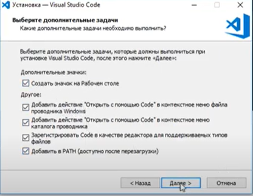

# УСТАНОВКА VISUAL STUDIO CODE ДЛЯ WINDOWS
----

1. Перейдите по [ссылке](https://code.visualstudio.com/download)
2. Скачайте установочный файл для вашей ОС
3. Зпустите файл установки
4. Согласитесь с условиями, выберете папку и нажмите "далее"
5. Выберете настройки и нажмите "далее" 

6. Нажмите "установить", а затем "finish"
