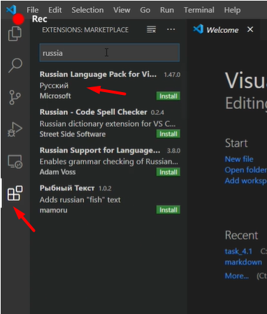
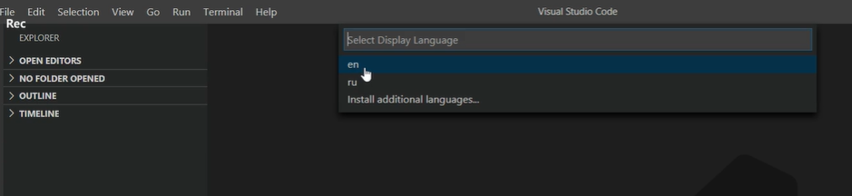
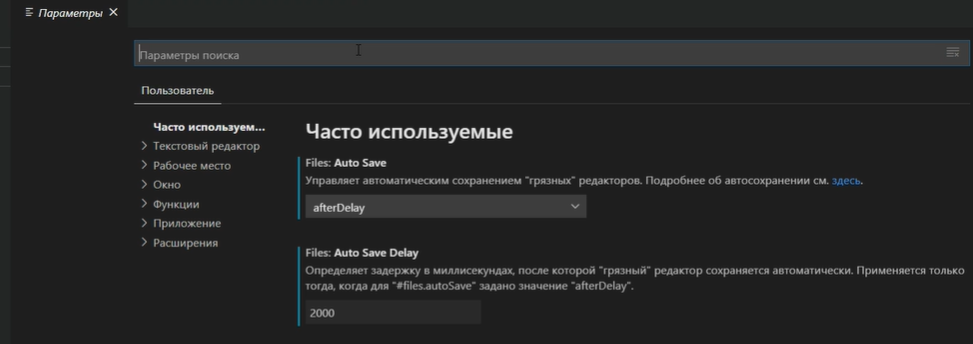

# УСТАНОВКА VISUAL STUDIO CODE ДЛЯ WINDOWS
----

1. Перейдите по [ссылке](https://code.visualstudio.com/download)
2. Скачайте установочный файл для вашей ОС
3. Зпустите файл установки
4. Согласитесь с условиями, выберете папку и нажмите "далее"
5. Выберете настройки и нажмите "далее" 

6. Нажмите "установить", а затем "finish"

-----

## Настройки для работы

* Зайти в установку расширений и найти пакет "Russian language"

* Нажать "install"

* Затем перейти "View">"command palette">"display language". И выбираем русский язык. Затем перезапускаем редактор.

* Настройка автосохранения. Для этого необходимо перейти "Файл">"Настройки автосохранения">"Параметры", выбрать в параметре Auto Save - "afterDelay"

